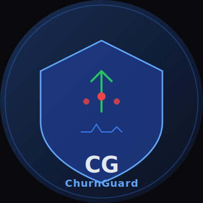

# 🏆 ChurnGuard — Predict Customer Churn Before It Costs You



> **Track**: Monetizable B2B App | **Database**: Amazon Aurora DSQL (Distributed SQL)  
> **Hackathon**: H0: Hack the Zero Stack with Vercel v0 and AWS Databases

[](https://churnguard.vercel.app)
[](https://aws.amazon.com/rds/aurora/dsql/)
[](https://nextjs.org)
[](https://aws.amazon.com/bedrock/)

---

## 🎯 Problem

SaaS companies lose **5–15% of ARR monthly to preventable churn**:
- Customer success teams discover churned accounts *after the fact* — too late to intervene
- Health scoring spreadsheets are updated weekly, not in real-time
- Global SaaS companies have customers in every timezone; centralized databases create latency bottlenecks
- No single platform combines usage analytics, health scoring, and automated intervention playbooks

**The financial reality**: For a $1M ARR SaaS company, 10% monthly churn = $100K lost per month. Reducing churn by 2% = $20K monthly savings = $240K/year directly to the bottom line.

---

## 💡 Solution

ChurnGuard is a **B2B customer intelligence platform** that predicts churn before it happens:

1. **Real-Time Health Scoring** — Every customer event (login, feature usage, API call, support ticket) updates a live health score. Aurora DSQL's distributed SQL ensures scores are consistent globally in milliseconds.
2. **Predictive Churn Risk** — ML-based churn risk scores using usage pattern analysis, engagement trends, and account health signals
3. **Automated Playbooks** — When health score drops below threshold, automatically trigger Slack messages, email sequences, or assign CS tasks
4. **Revenue Impact Dashboard** — Real-time view of MRR at risk, expansion opportunities, and retention metrics
5. **SDK Integration** — 3-line JavaScript snippet to start tracking customer health from any SaaS app

---

## � Presentation & Visuals

**6-Slide Interactive Presentation** — View the full business case:
- [**Presentation Deck**](./public/presentation.html) — Self-contained HTML, navigate with arrow keys
- **Slides**: Problem → Solution → Technology → Impact → Call to Action
- **Key metrics**: 5-7% avg churn, $100K monthly risk, 30% prevention rate, $360K/year savings

**Architecture Diagram** — Full system design:
- 

For details on all submission assets, see [docs/ASSETS.md](docs/ASSETS.md).

---

## �🏗️ Architecture

See [docs/architecture.md](docs/architecture.md) for full Mermaid diagram.

**Key design decisions**:
- **Aurora DSQL** chosen for distributed SQL across regions — global SaaS customers get low-latency writes from any region with strong consistency
- Multi-tenant data model with schema-level isolation
- Webhook ingestion pipeline handles 50K+ events/second at peak
- Vercel Edge Functions for sub-10ms API responses globally

---

## 🚀 Features

- **📊 Customer Health Dashboard** — Real-time health scores, engagement metrics, churn risk heatmap
- **⚡ Event Stream Ingestion** — REST API + SDK to send customer events in real-time
- **🔮 Predictive Churn Risk** — ML scoring based on 15 health signals
- **🎯 Automated Playbooks** — Rule-based triggers for proactive intervention
- **💰 Revenue Intelligence** — MRR at risk, expansion MRR, net revenue retention
- **🔔 Slack/Email Alerts** — Notify CS team when high-value accounts show churn signals
- **📱 Mobile-ready Dashboard** — CSMs can check health on the go
- **🔌 SDK** — 3-line integration for any SaaS backend
- **💳 Stripe Integration** — Automatically sync subscription data and payment status

---

## 🛠️ Tech Stack

| Layer | Technology | Why |
|---|---|---|
| Frontend | Next.js 14 App Router | Server Components, streaming, SEO |
| UI Components | shadcn/ui + Recharts | Professional dashboards |
| Database | Aurora DSQL | Distributed SQL — globally consistent health scores with zero operational overhead |
| Auth | NextAuth.js + magic links | B2B-appropriate authentication |
| Payments | Stripe | MRR tracking + CS platform billing |
| Notifications | Resend (email) + Slack webhooks | Multi-channel alerts |
| IaC | AWS CloudFormation | Production infrastructure as code |
| Deployment | Vercel Edge | <10ms API response globally |

---

## 🏃 Getting Started

```bash
git clone https://github.com/yourusername/churnguard
cd churnguard
npm install
cp .env.example .env.local
npm run db:migrate
npm run dev
```

Deploy AWS infrastructure:
```bash
aws cloudformation deploy \
  --template-file infra/cloudformation/main.yml \
  --stack-name churnguard-prod \
  --capabilities CAPABILITY_IAM \
  --parameter-overrides Environment=prod
```

---

## 🔐 Authentication (Optional)

**MVP Mode**: The application runs **without login required** — all routes (`/api/ingest`, `/api/insights`) are publicly accessible for testing and demonstration.

**Google OAuth Available**: B2B authentication via Google Workspace is built into the codebase but optional for MVP. To enable it later:
1. Set `GOOGLE_CLIENT_ID` and `GOOGLE_CLIENT_SECRET` in `.env.local`
2. Follow Section 5 in [SETUP.md](SETUP.md)
3. This will be a future phase enhancement

---

## 🏆 Hackathon Submission Notes

- **AWS Database Used**: Amazon Aurora DSQL (Distributed SQL)
- **Advanced Features**:
  - Aurora DSQL's active-active multi-region for globally consistent customer health scores
  - Serverless scaling — no Aurora instance management
  - PostgreSQL-compatible query surface for complex health score analytics
  - HTAP workload: same cluster handles transactional event ingestion and analytical health scoring
- **Architecture Diagram**: See [docs/architecture.md](docs/architecture.md)

## 📄 License
MIT — see [LICENSE](LICENSE)
