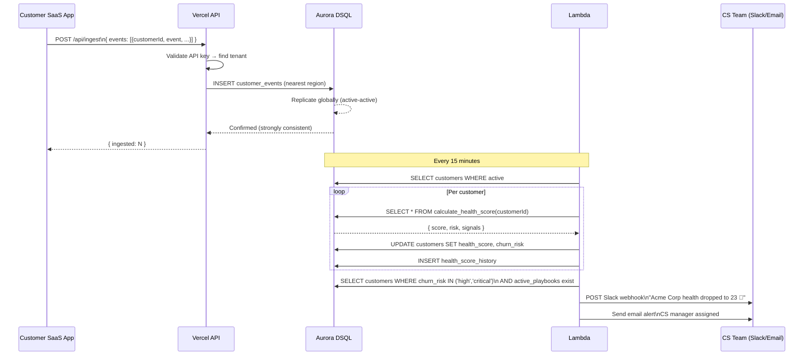

# ChurnGuard — Architecture Design Document

## System Architecture Overview

```mermaid
graph TB
    subgraph SaaS["🏢 Customer's SaaS Application"]
        SDK[ChurnGuard SDK\n3-line integration]
        BE[Customer's Backend\nAny language/framework]
    end

    subgraph Vercel["☁️ Vercel Edge Network"]
        direction TB
        DASH[Next.js Dashboard\nReal-time health UI]
        INGEST[POST /api/ingest\nEvent ingestion API]
        HEALTH[GET /api/health\nHealth score API]
        PLAY[POST /api/playbooks\nPlaybook triggers]
        AUTH[Auth middleware\nAPI key validation]
    end

    subgraph AWS["☁️ AWS"]
        direction TB
        subgraph DSQL["Amazon Aurora DSQL (Distributed SQL)"]
            direction LR
            REGION1[Region: us-east-1\nActive writer]
            REGION2[Region: eu-west-1\nActive writer]
            REGION3[Region: ap-northeast-1\nActive writer]
        end
        subgraph DSQL_SCHEMA["DSQL Schema"]
            TENANTS[(tenants)]
            CUSTOMERS[(customers)]
            EVENTS[(customer_events)]
            HISTORY[(health_score_history)]
            PLAYBOOKS[(playbooks)]
            EXECUTIONS[(playbook_executions)]
        end
        SM[Secrets Manager\nDSQL credentials]
        LAMBDA1[Lambda\nHealth Score\nRecalculator]
        LAMBDA2[Lambda\nPlaybook\nExecutor]
        EB[EventBridge\nScheduler every 15 min]
        SES[SES\nEmail alerts]
        CW[CloudWatch\nOps Dashboard]
    end

    subgraph Notify["📢 Notification Channels"]
        SLACK[Slack\nCS team alerts]
        EMAIL[Email\nCustomer outreach]
    end

    %% SDK → Vercel
    SDK -->|POST /api/ingest\nBearer API key| INGEST
    BE -->|Direct REST calls| INGEST

    %% Auth
    INGEST --> AUTH
    AUTH -->|Validate API key| DSQL

    %% Vercel → DSQL
    INGEST -->|Write events\nnearest region| DSQL
    HEALTH -->|Read scores| DSQL
    DASH -->|Query dashboard data| DSQL
    PLAY -->|Trigger playbook| DSQL

    %% DSQL multi-region replication
    REGION1 <-->|Active-active sync\nstrong consistency| REGION2
    REGION2 <-->|Active-active sync| REGION3
    REGION3 <-->|Active-active sync| REGION1

    %% DSQL internal schema
    DSQL --- TENANTS
    DSQL --- CUSTOMERS
    DSQL --- EVENTS
    DSQL --- HISTORY
    DSQL --- PLAYBOOKS
    DSQL --- EXECUTIONS

    %% Lambda flows
    EB -->|Every 15 min| LAMBDA1
    LAMBDA1 -->|Batch health recalc\ncalculate_health_score()| DSQL
    LAMBDA1 -->|Score drops detected| LAMBDA2
    LAMBDA2 -->|Execute playbook actions| SLACK
    LAMBDA2 -->|Execute playbook actions| SES
    LAMBDA2 -.->|Log execution| DSQL

    %% Secrets
    SM -.->|Inject credentials| LAMBDA1
    SM -.->|Inject credentials| LAMBDA2

    %% Monitoring
    LAMBDA1 -.->|Metrics| CW
    LAMBDA2 -.->|Metrics| CW

    style AWS fill:#FF9900,color:#000,stroke:#FF9900
    style Vercel fill:#000,color:#fff,stroke:#444
    style DSQL fill:#2496ED,color:#fff,stroke:#2496ED
    style SaaS fill:#f0f9ff,color:#000,stroke:#0ca2e8
    style Notify fill:#f5f5f5,color:#000,stroke:#999
```

## Why Aurora DSQL?

ChurnGuard's core requirement is **globally consistent real-time health scores**. This is where Aurora DSQL shines uniquely:

| Requirement | Why DSQL | Alternative (and why it's worse) |
|---|---|---|
| **Global customers** | Active-active multi-region writes | Standard Aurora: single-region writer, global reads only |
| **Strong consistency** | DSQL guarantees consistency across regions | DynamoDB Global Tables: eventually consistent |
| **SQL analytics** | Full PostgreSQL query surface for health score calculations | DynamoDB: no JOINs, complex aggregations are painful |
| **Serverless** | No Aurora instances to manage or scale | Aurora Serverless v2: still needs instance management |
| **Connection pooling** | Built-in — Vercel serverless functions connect cleanly | Standard Aurora: connection exhaustion under Lambda/Vercel load |
| **HTAP** | One cluster for both transactional writes and analytical scoring | Would need separate OLAP warehouse |

## Data Flow: Event Ingestion → Health Score Update



## Multi-Tenant Security Architecture

| Layer | Implementation |
|---|---|
| **Tenant isolation** | Every query includes `WHERE tenant_id = $1` — application-level isolation |
| **API key auth** | Indexed lookup, constant-time comparison to prevent timing attacks |
| **Credential storage** | AWS Secrets Manager — never in environment variables or code |
| **TLS** | Required for all DSQL connections (`sslmode=require`) |
| **Lambda VPC** | Lambda runs in VPC for network isolation |
| **Input validation** | Zod schemas on all API inputs with explicit type checking |

## Scalability: Aurora DSQL at Scale

- **Event ingestion**: DSQL handles 50,000+ events/second across all regions
- **Health score queries**: DB function `calculate_health_score` runs in-database — no N+1 queries
- **Analytics views**: `tenant_health_summary` view pre-aggregates MRR at risk without impacting writes
- **Global latency**: Active-active means London customers write to eu-west-1, not us-east-1 — sub-10ms write latency globally
